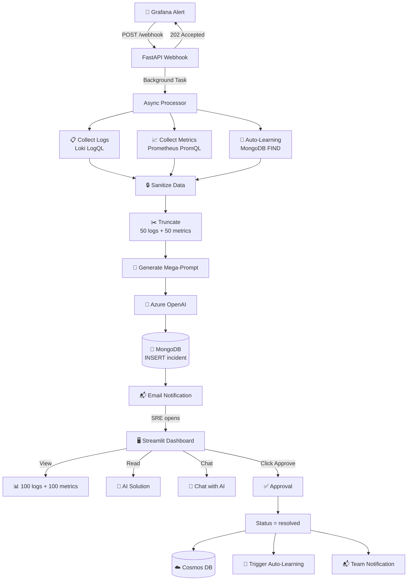
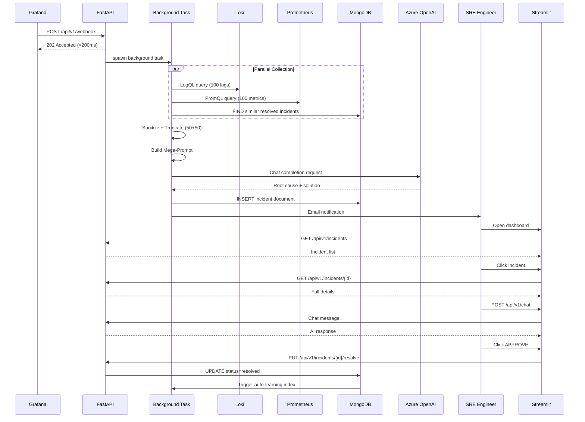
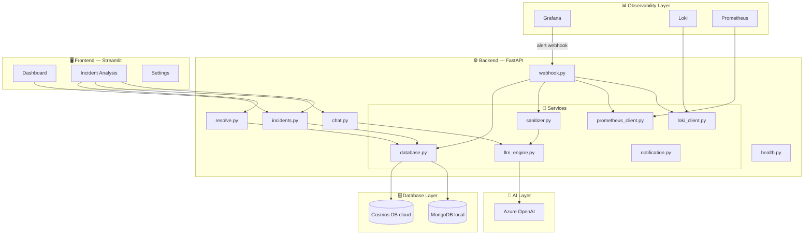
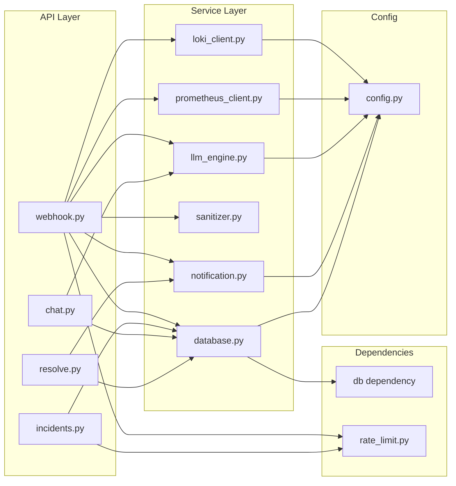
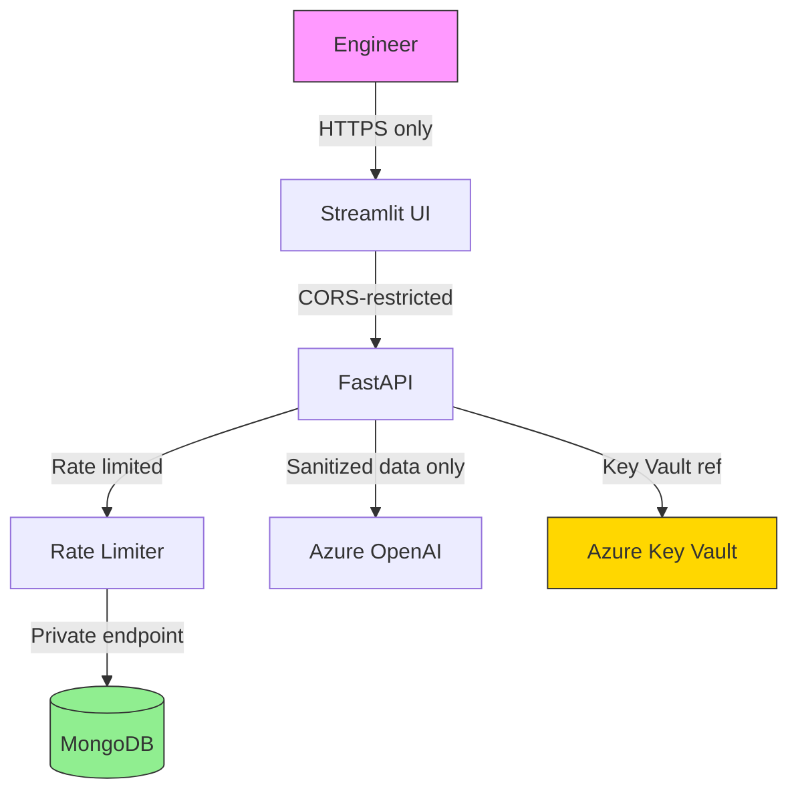
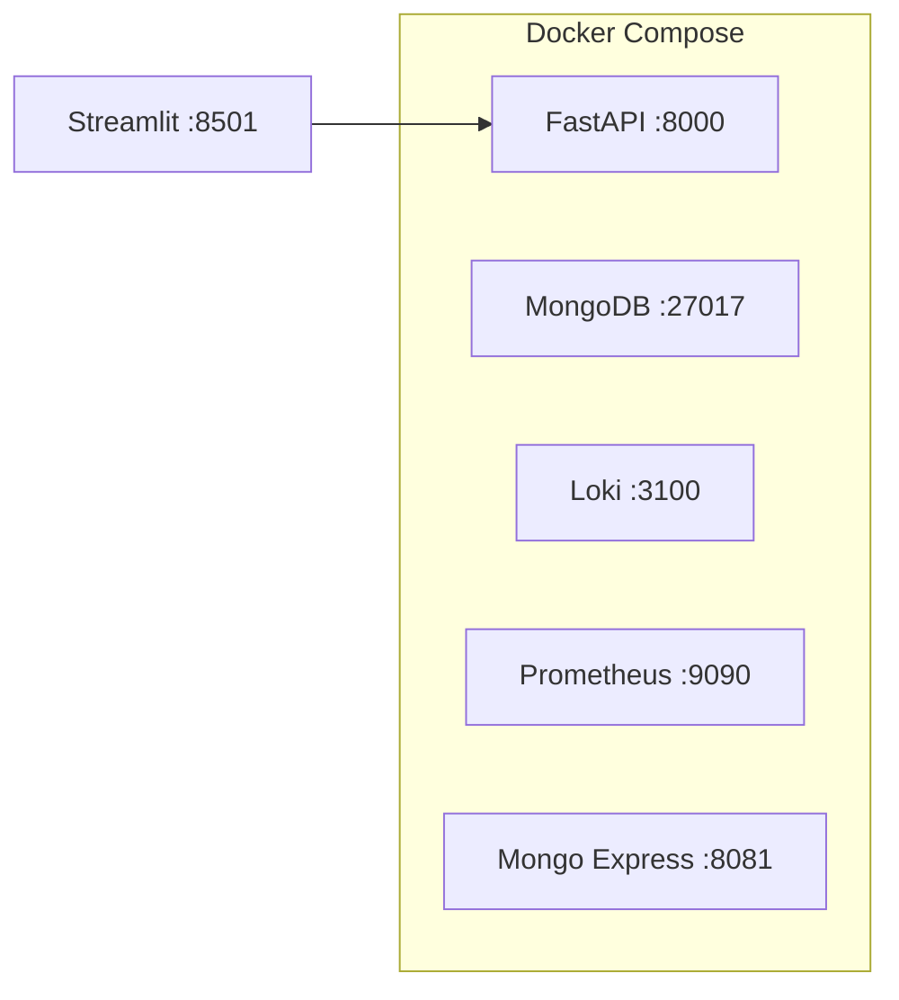
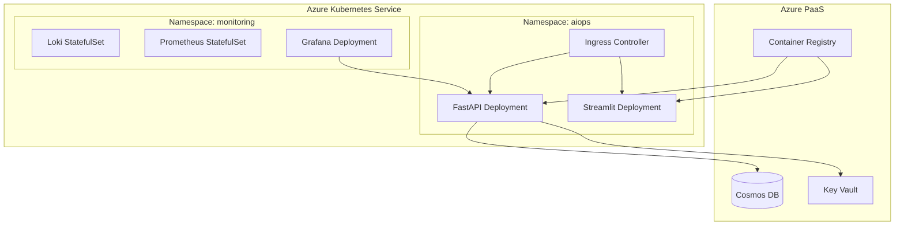

# 🏗️ ARCHITECTURE & STRUCTURE — ASSISTANT-SRE

## 1. PROJECT OVERVIEW

### What is Assistant-SRE?

**Assistant-SRE** is an AIOps platform designed to automate Site Reliability Engineering (SRE) workflows. It detects infrastructure incidents via Grafana alerts, collects logs and metrics from Loki and Prometheus, generates AI-powered root-cause analyses using Azure OpenAI, and provides a Streamlit dashboard for engineers to review, chat with the AI, and approve solutions.

### Key Features & Capabilities

| Feature | Description |
|---------|-------------|
| 🚨 **Incident Detection** | Receives Grafana webhooks, returns 202 immediately, processes in background |
| 📊 **Evidence Collection** | Fetches 100 logs (Loki LogQL) + 100 metrics (Prometheus PromQL) concurrently |
| 🧠 **AI Inference** | Sends sanitized data to Azure OpenAI for root-cause + solution generation |
| 🔄 **Auto-Learning** | Searches past resolved incidents for similar patterns (60-70% fewer tokens) |
| 🔒 **Data Sanitization** | Strips IPs, passwords, tokens before sending to cloud AI |
| ✅ **Approval Workflow** | Engineers review and approve/reject AI solutions via Streamlit dashboard |
| 📬 **Notifications** | Async email notifications to SRE team |
| 📈 **Observability** | Health checks, Prometheus metrics, structured JSON logs |

### Architecture Philosophy

- **Zero-Trust Security**: No secrets in code, CORS restrictions, rate limiting, non-root Docker user
- **AIOps**: Automated incident collection and diagnosis; human only approves, never investigates blindly
- **Auto-Learning**: Every resolved incident enriches future prompts, continuously improving accuracy and reducing cost

---

## 2. DIRECTORY STRUCTURE

```
Assistant-SRE/
│
├── backend/                          # FastAPI backend service
│   ├── app/
│   │   ├── main.py                   # FastAPI entry point with Lifespan context manager
│   │   ├── config.py                 # Pydantic Settings for env vars (type-safe config)
│   │   ├── api/
│   │   │   └── v1/
│   │   │       ├── router.py         # Routes aggregator (includes all sub-routers)
│   │   │       ├── webhook.py        # POST /webhook — Grafana alert receiver (202 Accepted)
│   │   │       ├── incidents.py      # GET /incidents — paginated incident list
│   │   │       ├── chat.py           # POST /chat — AI conversation per incident
│   │   │       ├── health.py         # GET /healthz and /readyz endpoints
│   │   │       └── resolve.py        # PUT /resolve — engineer approval workflow
│   │   ├── models/
│   │   │   ├── base.py               # Shared base model (timestamps, ID)
│   │   │   ├── webhook.py            # AlertPayload — Grafana webhook validation
│   │   │   ├── incident.py           # IncidentSchema — stored incident document
│   │   │   ├── chat.py               # ChatRequest / ChatResponse models
│   │   │   └── error.py              # Error response models
│   │   ├── services/
│   │   │   ├── database.py           # Async MongoDB/Cosmos DB client (Motor)
│   │   │   ├── loki_client.py        # Query logs using LogQL via HTTP
│   │   │   ├── prometheus_client.py  # Query metrics using PromQL via HTTP
│   │   │   ├── sanitizer.py          # Remove sensitive data (IPs, passwords, tokens)
│   │   │   ├── llm_engine.py         # Azure OpenAI integration (prompt + inference)
│   │   │   └── notification.py       # Async SMTP email notifications
│   │   ├── dependencies/
│   │   │   ├── database.py           # FastAPI dependency injection for DB client
│   │   │   └── rate_limit.py         # Sliding-window rate limiter middleware
│   │   ├── core/
│   │   │   ├── exceptions.py         # Custom HTTP exceptions (404, 422, 500 etc.)
│   │   │   ├── logging.py            # JSON structured logging (structlog/loguru)
│   │   │   └── constants.py          # Global constants (collection names, limits)
│   │   └── utils/
│   │       ├── validators.py         # Pydantic custom validators
│   │       └── helpers.py            # Utility functions (truncate, format)
│   │
│   ├── tests/
│   │   ├── conftest.py               # Pytest fixtures (async client, mock DB)
│   │   ├── test_api/                 # API endpoint tests (webhook, incidents, chat)
│   │   ├── test_services/            # Service unit tests (loki, prometheus, llm)
│   │   └── test_models/              # Model validation tests
│   │
│   ├── docker-compose.yml            # Local dev stack (MongoDB, Loki, Prometheus, API)
│   ├── Dockerfile                    # Multi-stage production image (non-root)
│   ├── requirements.txt              # Runtime dependencies
│   ├── pyproject.toml                # Modern Python packaging + tool config
│   └── .env.example                  # Environment variable template
│
├── frontend/                         # Streamlit web dashboard
│   ├── streamlit_app.py              # Main entry point (multi-page app)
│   ├── pages/
│   │   ├── 01_Dashboard.py           # Incidents list with filters
│   │   ├── 02_Incident_Analysis.py   # Incident details + AI solution + chat
│   │   └── 03_Settings.py            # Configuration panel
│   ├── components/
│   │   ├── incident_header.py        # Alert metadata display
│   │   ├── logs_section.py           # 100-log viewer with search
│   │   ├── metrics_section.py        # 100-metric viewer with charts
│   │   ├── ai_solution.py            # AI suggestion panel
│   │   ├── chatbot_section.py        # Real-time chat interface
│   │   └── approval_buttons.py       # Approve / Reject buttons
│   ├── services/
│   │   ├── backend_api.py            # Backend API client (httpx async)
│   │   ├── cache_manager.py          # In-memory caching layer (5min TTL)
│   │   └── formatter.py              # Data formatting (timestamps, labels)
│   ├── utils/
│   │   ├── constants.py              # Colors, icons, UI config
│   │   ├── session_manager.py        # Streamlit session state management
│   │   └── helpers.py                # Shared utilities
│   ├── requirements.txt              # Frontend dependencies
│   └── .env.example                  # Environment variable template
│
├── docs/
│   ├── ARCHITECTURE_STRUCTURE.md     # ← This file
│   ├── LOCAL_TESTING_GUIDE.md        # Step-by-step local setup guide
│   ├── FASTAPI_ARCHITECTURE_DETAILED.md  # Detailed backend architecture
│   └── TESTING_PLAN_AKS.md           # Kubernetes / AKS deployment guide
│
└── README.md                         # Main project overview
```

---

## 3. DATA FLOW ARCHITECTURE

### High-Level Flow



### Request Lifecycle



---

## 4. SYSTEM ARCHITECTURE DIAGRAM



---

## 5. TECHNOLOGY STACK

### Backend

| Technology | Version | Purpose |
|------------|---------|---------|
| **FastAPI** | ≥0.104 | Async REST API framework |
| **Pydantic v2** | ≥2.0 | Request/response validation + settings |
| **Motor** | ≥3.3 | Async MongoDB driver |
| **httpx** | ≥0.25 | Async HTTP client (Loki, Prometheus) |
| **Azure OpenAI** | latest | LLM inference (GPT-4o) |
| **aiosmtplib** | ≥3.0 | Async email notifications |
| **uvicorn** | ≥0.24 | ASGI server |

### Frontend

| Technology | Version | Purpose |
|------------|---------|---------|
| **Streamlit** | ≥1.28 | Web UI framework |
| **Pandas** | ≥2.0 | Data processing |
| **Plotly** | ≥5.0 | Interactive charts |
| **httpx** | ≥0.25 | Backend API client |

### Database

| System | Usage |
|--------|-------|
| **MongoDB 7.0** | Local development |
| **Cosmos DB** (MongoDB API) | Production (Azure) |

### Observability

| System | Role |
|--------|------|
| **Loki** | Log aggregation and storage |
| **Prometheus** | Metrics scraping and storage |
| **Grafana** | Alert rules and dashboards |

### Infrastructure

| Component | Environment |
|-----------|-------------|
| **Docker Compose** | Local development |
| **Kubernetes (AKS)** | Production |
| **Azure Key Vault** | Secrets management |
| **GitHub Actions** | CI/CD pipeline |

---

## 6. COMPONENT DEPENDENCY DIAGRAM



---

## 7. KEY FEATURES EXPLAINED

### A. Incident Detection

- Receives Grafana alert via `POST /api/v1/webhook`
- Returns `202 Accepted` **immediately** (< 200 ms) — non-blocking pattern
- Actual processing happens in a FastAPI `BackgroundTask`
- Full processing time: 2-5 seconds (hidden from caller)

### B. Evidence Collection (Parallel)

```python
# Concurrent execution — not sequential
logs, metrics = await asyncio.gather(
    loki_client.get_logs(labels, limit=100),
    prometheus_client.get_metrics(query, limit=100)
)
```

- Fetches last **100 logs** from Loki (LogQL)
- Fetches **100 metrics** from Prometheus (PromQL)
- Parallel execution via `asyncio.gather()`

### C. Auto-Learning

1. New incident arrives (`OOMKilled` on `pod-A`)
2. MongoDB query: `FIND resolved incidents WHERE alert_name ~= "OOMKilled"`
3. If found → inject past solution into prompt
4. Result: **60-70% fewer OpenAI tokens consumed**
5. Save new resolution → feeds future auto-learning

### D. Data Sanitization

| Data Type | Before | After |
|-----------|--------|-------|
| IP Address | `192.168.1.100` | `X.X.X.X` |
| Password | `password=s3cr3t` | `password=***` |
| Bearer Token | `Bearer eyJ...` | `Bearer ****` |
| API Key | `api_key=abc123` | `api_key=***` |

Privacy-first: data is sanitized **before** sending to Azure OpenAI.

### E. AI Inference (Azure OpenAI)

- Sends: sanitized logs + metrics + alert labels + similar past resolutions
- Receives: root cause + recommended steps + confidence score
- Model: GPT-4o (configurable)
- Optional streaming responses

### F. Solution Storage

- Incident document stored in MongoDB/Cosmos DB
- Includes: logs, metrics, AI diagnostic, approval status
- Indexed on `alert_name` + `status` for fast auto-learning queries
- TTL policy on resolved incidents (configurable)

### G. Engineer Approval Workflow

```
SRE opens Streamlit dashboard
    → Views alert metadata
    → Reads AI-proposed solution
    → Reviews 100 logs + 100 metrics
    → Chats with AI for clarifications
    → Clicks APPROVE (or REJECT)
    → Status → "resolved"
    → Auto-learning triggered
    → Team notified
```

---

## 8. SECURITY ARCHITECTURE (Zero-Trust)



| Security Control | Implementation |
|-----------------|----------------|
| **Secrets management** | `.env` locally; Azure Key Vault in production |
| **CORS** | Restricted to allowed origins in `config.py` |
| **Rate limiting** | Sliding window per IP (`rate_limit.py`) |
| **No hardcoded credentials** | Enforced via Pydantic Settings |
| **Data sanitization** | `sanitizer.py` removes PII before AI calls |
| **Non-root Docker** | Dockerfile uses `USER appuser` |
| **Connection pooling** | Motor client with max pool size |
| **Private endpoints** | Azure services behind VNet (production) |

---

## 9. PERFORMANCE OPTIMIZATIONS

| Optimization | Detail |
|-------------|--------|
| **Async/await everywhere** | Non-blocking I/O — no thread blocking |
| **Connection pooling** | Motor maintains MongoDB connection pool |
| **Request truncation** | 100 logs/metrics collected, 50 sent to OpenAI |
| **Caching** | Incident list cached for 5 minutes (TTL) |
| **Background tasks** | Webhook handler returns in < 200 ms |
| **Database indexes** | `alert_name`, `status`, `created_at` indexed |
| **Rate limiting** | Protects API from abuse and cost overruns |
| **Auto-learning** | Reuse past solutions → 60-70% token reduction |

---

## 10. DEPLOYMENT TARGETS

### Local Development



### Production (AKS)



---

## 11. MONITORING & ALERTING

| Signal | Source | Destination |
|--------|--------|-------------|
| Application logs | FastAPI structured JSON | Loki |
| Request metrics | FastAPI Prometheus middleware | Prometheus |
| Health checks | `/healthz` + `/readyz` | Kubernetes probes |
| Alert rules | Grafana (error rate > 5%) | `POST /api/v1/webhook` |
| SRE notifications | FastAPI → aiosmtplib | Engineer email |

---

## 12. TESTING STRATEGY

| Layer | Test Type | Tool |
|-------|-----------|------|
| Models | Unit — validation | pytest + pydantic |
| Services | Unit — mock clients | pytest + httpx mock |
| API | Integration — test DB | pytest-asyncio + httpx |
| Full flow | E2E — alert → approval | Docker Compose + curl |
| CI/CD | Automated on push | GitHub Actions |

Target coverage: **> 90%**

---

## 13. COMMON WORKFLOWS

### A. Incident Detection Flow

```
1. Grafana detects alert (CPU > 80%, OOMKilled, etc.)
2. POSTs to /api/v1/webhook with labels
3. FastAPI returns 202 Accepted immediately
4. Background task:
   a. Fetches logs (Loki) + metrics (Prometheus) concurrently
   b. Queries MongoDB for similar past incidents
   c. Sanitizes all collected data
   d. Truncates to 50 logs + 50 metrics
   e. Builds mega-prompt with context
   f. Calls Azure OpenAI → root cause + solution
   g. Saves incident to Cosmos DB
   h. Sends email notification to SRE team
```

### B. SRE Review Flow

```
1. SRE opens Streamlit dashboard (http://dashboard:8501)
2. Sees list of open incidents (sorted by severity/time)
3. Clicks on incident to view details
4. Reviews: alert metadata, 100 logs, 100 metrics
5. Reads AI-proposed solution with confidence score
6. Asks follow-up questions in chat interface
7. Clicks APPROVE when confident
8. Incident marked as "resolved"
9. Solution stored for auto-learning
10. Team notified of resolution
```

### C. Auto-Learning Flow

```
1. New incident: OOMKilled on pod-webapp-abc
2. MongoDB FIND: alert_name ~= "OOMKilled", status = "resolved"
3. Match found: OOMKilled on pod-webapp-xyz (resolved 2 days ago)
4. Past solution injected into prompt context
5. Azure OpenAI produces accurate, context-rich solution
6. New incident saved (feeds next auto-learning cycle)
7. Cost savings: ~65% fewer tokens vs. zero-shot prompt
```

---

## 14. FUTURE ENHANCEMENTS

| Feature | Priority | Description |
|---------|----------|-------------|
| WebSocket updates | High | Real-time incident push to dashboard |
| Metrics charts | High | Plotly charts in Streamlit for metrics |
| PDF export | Medium | Export incident report as PDF |
| Slack/Teams | Medium | Notification via chat platforms |
| Multi-tenant | Medium | Support multiple teams/orgs |
| Custom rules | Low | Define custom alert-to-prompt rules |
| Custom LLM | Low | Plug-in local/fine-tuned models |

---

## 🔗 Related Documentation

- [LOCAL_TESTING_GUIDE.md](./LOCAL_TESTING_GUIDE.md) — Step-by-step local setup
- [FASTAPI_ARCHITECTURE_DETAILED.md](./FASTAPI_ARCHITECTURE_DETAILED.md) — Backend deep-dive
- [TESTING_PLAN_AKS.md](./TESTING_PLAN_AKS.md) — Kubernetes deployment guide
- [README.md](../README.md) — Project overview
