# 👑 Architecture V6 FINALE — Plateforme SRE AIOps Zero-Trust

---

## 🔑 Inventaire des Composants

| Catégorie | Composants |
|---|---|
| **Azure PaaS (Hors VNet)** | ACR, OpenAI, Key Vault, Cosmos DB (API MongoDB Serverless) |
| **Azure SaaS (Hors VNet)** | Azure DevOps (CI) |
| **Private Endpoints (Subnet 3)** | PE:ACR (`10.0.2.10`), PE:OpenAI (`10.0.2.20`), PE:KeyVault (`10.0.2.30`), PE:CosmosDB (`10.0.2.40`) |
| **Private DNS Zones** | `privatelink.azurecr.io`, `privatelink.openai.azure.com`, `privatelink.vaultcore.azure.net`, `privatelink.mongo.cosmos.azure.com` |
| **NS 0 (kube-system)** | AGIC, CoreDNS |
| **NS 1 (flux-system)** | FluxCD |
| **NS 2 (app-demo)** | Nginx, FastAPI, MySQL, mysql-exporter |
| **NS 3 (monitoring)** | Grafana, Prometheus, Grafana Alloy, Loki |
| **NS 4 (assistant-sre)** | Streamlit, FastAPI AIOps, SecretProviderClass |
| **Externe** | Microsoft Teams (Webhook) |

---

## 1️⃣ Architecture Globale — Toutes les Communications

```mermaid
flowchart TD
    classDef cloud fill:#e0f2fe,stroke:#0284c7,stroke-width:2px,color:#0f172a
    classDef vnet fill:#f0fdf4,stroke:#15803d,stroke-width:3px,color:#0f172a
    classDef gw fill:#fef08a,stroke:#ca8a04,stroke-width:2px,color:#0f172a
    classDef pe fill:#fecdd3,stroke:#e11d48,stroke-width:2px,color:#0f172a
    classDef app fill:#eff6ff,stroke:#2563eb,stroke-width:2px,color:#0f172a
    classDef mon fill:#f0fdf4,stroke:#16a34a,stroke-width:2px,color:#0f172a
    classDef ai fill:#faf5ff,stroke:#9333ea,stroke-width:2px,color:#0f172a
    classDef sys fill:#f4f4f5,stroke:#71717a,stroke-width:2px,color:#0f172a
    classDef paas fill:#fff7ed,stroke:#ea580c,stroke-width:2px,color:#0f172a
    classDef dns fill:#f0f9ff,stroke:#0369a1,stroke-width:2px,color:#0f172a
    classDef ext fill:#fce7f3,stroke:#be185d,stroke-width:2px,color:#0f172a

    ADMIN(("👨🔧 SRE"))
    DEV(("👥 Dev"))
    TEAMS["💬 Microsoft Teams"]:::ext

    subgraph AZURE_CLOUD ["☁️ PUBLIC AZURE CLOUD"]

        AZ_DEVOPS["⚙️ Azure DevOps\n(CI Pipeline — SaaS)"]:::ext
        P_ACR["📦 Azure Container Registry"]:::paas
        P_OAI["🤖 Azure OpenAI\n(GPT-3.5)"]:::paas
        P_KV["🔑 Azure Key Vault"]:::paas
        P_COSMOS["🪐 Azure Cosmos DB\n(API MongoDB - Serverless)"]:::paas

        subgraph DNS_ZONES ["🌎 Azure Private DNS Zones"]
            DNS_ACR["privatelink.azurecr.io\n→ 10.0.2.10"]:::dns
            DNS_OAI["privatelink.openai.azure.com\n→ 10.0.2.20"]:::dns
            DNS_KV["privatelink.vaultcore.azure.net\n→ 10.0.2.30"]:::dns
            DNS_COSMOS["privatelink.mongo.cosmos...\n→ 10.0.2.40"]:::dns
        end

        subgraph VNET ["🔒 VNet (10.0.0.0/16)"]

            subgraph S1 ["Subnet 1 — Gateway (10.0.0.0/25)"]
                WAF["🛡️ App Gateway + WAF"]:::gw
            end

            subgraph S2 ["Subnet 2 — AKS (10.0.1.0/24)"]

                subgraph NS0 ["0️⃣ kube-system"]
                    AGIC["🔗 AGIC"]:::sys
                    COREDNS["🧭 CoreDNS"]:::sys
                end

                subgraph NS1 ["1️⃣ flux-system"]
                    FLUX["🔄 FluxCD"]:::sys
                end

                subgraph NS2 ["2️⃣ app-demo"]
                    FE["🌐 Nginx"]:::app
                    API_DEMO["⚙️ Backend FastAPI"]:::app
                    MYSQL["📁 MySQL"]:::app
                    MYSQL_EXP["📊 mysql-exporter"]:::app
                end

                subgraph NS3 ["3️⃣ monitoring"]
                    GRAFANA["📊 Grafana"]:::mon
                    PROM["👁️ Prometheus"]:::mon
                    ALLOY["🔥 Grafana Alloy"]:::mon
                    LOKI["💬 Loki"]:::mon
                end

                subgraph NS4 ["4️⃣ assistant-sre"]
                    SRE_UI["💻 Streamlit"]:::ai
                    SRE_API["🧠 FastAPI AIOps"]:::ai
                    SPC["🔐 SecretProviderClass"]:::ai
                end

            end

            subgraph S3 ["Subnet 3 — Private Endpoints (10.0.2.0/25)"]
                PE_ACR{"PE: ACR\n10.0.2.10"}:::pe
                PE_OAI{"PE: OpenAI\n10.0.2.20"}:::pe
                PE_KV{"PE: Key Vault\n10.0.2.30"}:::pe
                PE_COSMOS{"PE: Cosmos DB\n10.0.2.40"}:::pe
            end

        end

    end

    %% ─── CI/CD ───
    DEV -. "Git Push" .-> AZ_DEVOPS
    AZ_DEVOPS == "Build & Push Image\n(Service Tag Firewall)" ==> P_ACR
    AZ_DEVOPS -. "Update YAML Tag" .-> FLUX
    FLUX -- "Pull Image\n(Private Endpoint)" --> PE_ACR
    PE_ACR -. "Tunnel Privé" .-> P_ACR
    FLUX -- "Déploie Pods" --> NS2 & NS3 & NS4

    %% ─── DNS ───
    COREDNS -. "Résolution FQDN" .-> DNS_ZONES
    DNS_ZONES -. "Retourne IP\nSubnet 3" .-> COREDNS

    %% ─── Trafic Externe ───
    ADMIN == "HTTPS" ==> WAF
    AGIC -. "Routage L7" .- WAF
    WAF == "/app" ==> FE
    WAF == "/ai" ==> SRE_UI

    %% ─── App-Demo ───
    FE --> API_DEMO --> MYSQL

    %% ─── Observabilité (Logs) ───
    ALLOY -. "Collecte Logs" .-> FE & API_DEMO & MYSQL
    ALLOY -- "Push Logs" --> LOKI

    %% ─── Observabilité (Métriques) ───
    PROM -. "Scraping" .-> FE & API_DEMO & MYSQL_EXP
    MYSQL_EXP -. "Expose port 9104" .-> MYSQL
    GRAFANA -. "PromQL" .-> PROM
    GRAFANA -. "LogQL" .-> LOKI

    %% ─── Alerte → Assistant SRE ───
    GRAFANA -. "Webhook Alerte" .-> SRE_API

    %% ─── Key Vault → Pods ───
    SPC -- "Monte Secrets\n(API Key, DB Pass)" --> PE_KV
    PE_KV -. "Tunnel Privé" .-> P_KV

    %% ─── Assistant SRE ───
    SRE_UI <-->|"API REST"| SRE_API
    SRE_API -. "GET Logs/Métriques" .-> LOKI & PROM
    SRE_API -- "FIND / INSERT / UPDATE" --> PE_COSMOS
    PE_COSMOS -. "Tunnel Privé" .-> P_COSMOS
    SRE_API -- "Mega-Prompt" --> PE_OAI
    PE_OAI -. "Tunnel Privé" .-> P_OAI
    SRE_API -. "Webhook Notif" .-> TEAMS

    class VNET vnet;
    class AZURE_CLOUD cloud;
```



---

## 2️⃣ Architecture FastAPI Backend — Workflow Complet

```mermaid
flowchart TD
    classDef data fill:#f1f5f9,stroke:#94a3b8,color:#0f172a
    classDef logic fill:#eff6ff,stroke:#3b82f6,stroke-width:2px,color:#0f172a
    classDef decision fill:#fef9c3,stroke:#ca8a04,stroke-width:2px,color:#0f172a
    classDef ai fill:#fce7f3,stroke:#ec4899,stroke-width:2px,color:#0f172a
    classDef security fill:#fef2f2,stroke:#dc2626,stroke-width:2px,color:#0f172a
    classDef storage fill:#f0fdf4,stroke:#16a34a,stroke-width:2px,color:#0f172a

    WEBHOOK["🔴 Webhook Grafana\n(alert_name, pod, labels)"]:::data
    RECV["⚡ POST /api/webhook"]:::logic
    WEBHOOK --> RECV

    subgraph COLLECT ["① Collecte des Preuves"]
        direction LR
        LOGS["GET 100 Logs\n(Loki — LogQL)"]:::logic
        METRICS["GET 100 Métriques\n(Prometheus — PromQL)"]:::logic
    end
    RECV --> COLLECT

    subgraph AUTOLEARN ["② Auto-Learning — FIND (0 Token)"]
        SQL["Cosmos DB (PaaS):\ndb.incidents.find_one(\n  alert_name='OOMKilled',\n  sort: date DESC\n)"]:::logic
        CHECK{"Incident\nconnu ?"}:::decision
        YES["past_solution =\n'Augmenter RAM 512Mi'"]:::logic
        NO["past_solution = None"]:::logic
        SQL --> CHECK
        CHECK -- "OUI" --> YES
        CHECK -- "NON" --> NO
    end
    COLLECT --> AUTOLEARN

    subgraph TRUNC ["③ Troncature (FinOps)"]
        CUT["Garder 50 derniers\nLogs + 50 Métriques"]:::logic
    end
    YES --> TRUNC
    NO --> TRUNC

    subgraph SANITIZE ["④ Sanitizer Sécurité 🔐"]
        CLEAN["Nettoyage Regex :\npassword=*** | token=***\nIP → X.X.X.X"]:::security
    end
    TRUNC --> SANITIZE

    subgraph PROMPT ["⑤ Mega-Prompt (Azure OpenAI)"]
        BUILD["Assemblage :\n• Contexte Alerte\n• 50 Logs Nettoyés\n• 50 Métriques\n• Solution Passée (si dispo)"]:::logic
        GPT["🤖 Azure OpenAI\n(via PE: 10.0.2.20)"]:::ai
        RESP["Réponse JSON :\n• Cause Racine\n• Commande K8s"]:::data
        BUILD --> GPT --> RESP
    end
    SANITIZE --> BUILD

    subgraph SAVE ["⑥ Sauvegarde — INSERT"]
        MONGO_WRITE["Cosmos DB (PaaS):\ndb.incidents.insert_one(\n  incident_id, alert_name,\n  diagnostic, solution,\n  status='ouvert', date\n)"]:::logic
    end
    RESP --> MONGO_WRITE
    MONGO_WRITE --> MONGO_DB[("Cosmos DB Serverless\n(API MongoDB)")]:::storage

    subgraph NOTIF ["⑦ Notification"]
        TEAMS_POST["POST → Webhook Teams\n(Résumé + Lien Dashboard)"]:::logic
    end
    RESP --> TEAMS_POST

    subgraph UI ["⑧ Interface Streamlit"]
        INDEX["Index des Incidents\n(db.incidents.find)"]:::logic
        CLICK["Clic SRE sur un incident"]:::data
        DETAIL["Affichage :\n• Diagnostic IA\n• Logs (GET Loki)\n• Métriques (GET Prometheus)"]:::logic
        CHAT["💬 Chatbot :\nIngénieur pose question\n→ FastAPI re-prompt GPT"]:::logic
        VALID["✅ Valider Solution\nMongoDB: UPDATE\nstatus='résolu'"]:::logic
        INDEX --> CLICK --> DETAIL --> CHAT --> VALID
    end
    MONGO_DB -. "FIND (index)" .-> INDEX
    VALID -. "UPDATE" .-> MONGO_DB
```



---

## 3️⃣ Structure du Code FastAPI

```text
aiops-backend/
├── main.py                      # Démarrage Uvicorn
│
├── api/routes/
│   ├── webhook.py               # POST /api/webhook
│   ├── incidents.py             # GET  /api/incidents
│   ├── chat.py                  # POST /api/chat
│   └── resolve.py               # PUT  /api/incidents/{id}/resolve
│
├── services/
│   ├── loki_client.py           # GET LogQL
│   ├── prometheus_client.py     # GET PromQL
│   ├── sanitizer.py             # 🔐 Nettoyage Regex
│   ├── mongo_db.py              # FIND / INSERT / UPDATE (pymongo)
│   ├── llm_engine.py            # Mega-Prompt + Azure OpenAI
│   └── teams_notify.py          # POST Webhook Teams
│
├── models/
│   ├── grafana_webhook.py       # Schema Pydantic entrant
│   ├── incident.py              # Schema document MongoDB
│   └── chat_message.py          # Schema chat
│
└── requirements.txt
```

---

## 4️⃣ Les 3 Opérations Cosmos DB (API MongoDB)

```text
SCÉNARIO 1 — Alerte Nouvelle
  FastAPI → Cosmos DB : FIND(alert_name='X') → Rien
  FastAPI → OpenAI    : Prompt SANS historique
  FastAPI → Cosmos DB : INSERT(incident + diagnostic)

SCÉNARIO 2 — Alerte Récurrente
  FastAPI → Cosmos DB : FIND(alert_name='X') → Solution trouvée
  FastAPI → OpenAI    : Prompt AVEC "La dernière fois on a fait..."
  FastAPI → Cosmos DB : INSERT(nouvel incident + nouveau diagnostic)

SCÉNARIO 3 — Validation Humaine
  Streamlit → FastAPI → Cosmos DB : UPDATE(status='résolu')
  = L'Auto-Learning est prêt pour la prochaine alerte
```
