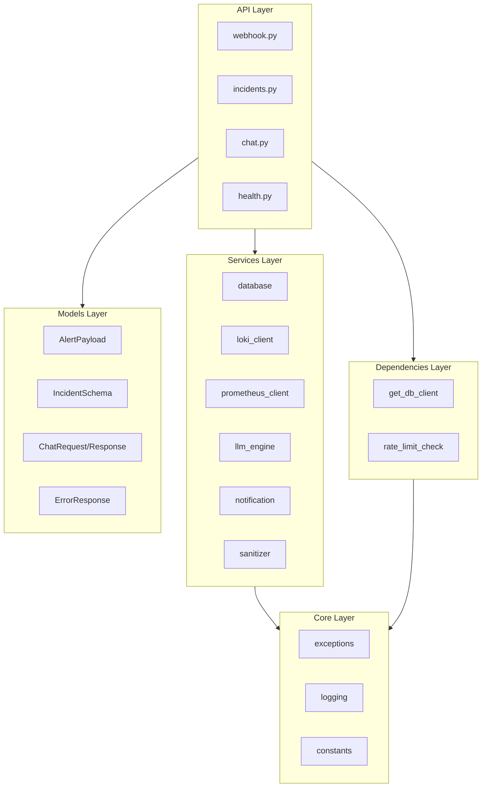
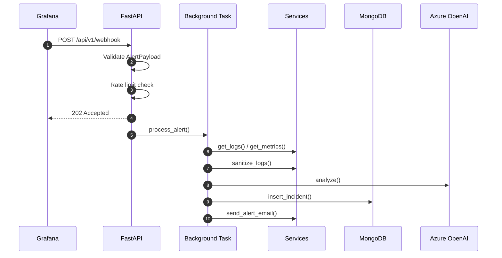
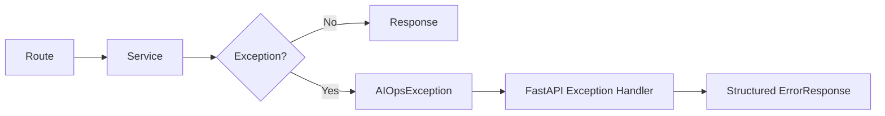
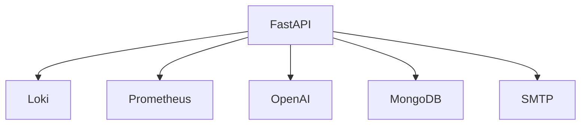
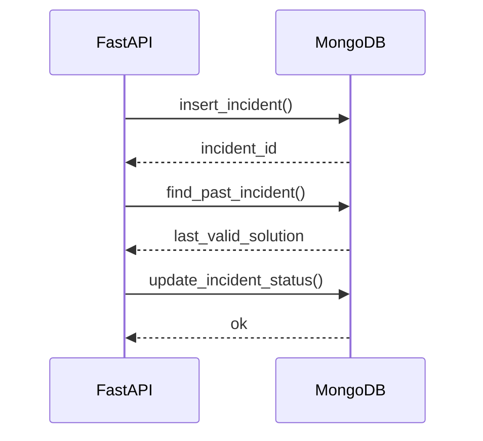

# 🏗️ FastAPI Architecture — Detailed Design (Assistant-SRE)

This document details the layered architecture, data flows, dependency injection, error handling, async best practices, and service integrations for the Assistant-SRE backend.

---

## 1️⃣ Layered Architecture Overview

**Layers:**
1. **API Layer** — FastAPI routers (`app/api/v1/*`)
2. **Dependencies Layer** — DI helpers (`app/dependencies/*`)
3. **Services Layer** — Business logic & integrations (`app/services/*`)
4. **Models Layer** — Pydantic schemas (`app/models/*`)
5. **Core Layer** — shared utilities (`app/core/*`)
6. **Infrastructure** — external services (MongoDB, Loki, Prometheus, Azure OpenAI, SMTP)

### Mermaid — Layer Interactions

---

## 2️⃣ Request / Response Flow

### Example: `/api/v1/webhook`
1. **Request** arrives with Grafana JSON payload
2. **Pydantic validation** ensures schema correctness
3. **Rate limiting middleware** applies global protection
4. **Background task** triggers async pipeline
5. **Services** collect logs, metrics, sanitize data
6. **LLM** generates diagnostic solution
7. **Database** persists incident
8. **Notification** sends email

### Mermaid — Request Lifecycle

---

## 3️⃣ Dependency Injection Patterns

- **Database** injected via `get_db_client()`
- **Rate limiting** enforced via middleware and DI helper
- Shared settings via `app.config.settings`

**Why DI?**
- Simplifies testing (mock dependencies)
- Improves modularity
- Avoids global state coupling

---

## 4️⃣ Error Handling (Centralized)

All domain errors extend `AIOpsException` and are handled in `main.py`.

### Mermaid — Error Handling Flow

---

## 5️⃣ Async/Await Best Practices

✅ All I/O operations are async:
- MongoDB via **Motor**
- HTTP requests via **httpx.AsyncClient**
- SMTP via **aiosmtplib**
- OpenAI via **AsyncAzureOpenAI**

✅ Background tasks for long-running workloads (`/webhook`).

✅ No blocking calls in request handlers.

---

## 6️⃣ Service Integration Points

| Service | File | Purpose |
|--------|------|---------|
| MongoDB / Cosmos DB | `services/database.py` | Persist incidents + Auto-learning |
| Loki | `services/loki_client.py` | Query logs with LogQL |
| Prometheus | `services/prometheus_client.py` | Query metrics with PromQL |
| Azure OpenAI | `services/llm_engine.py` | Generate diagnostics |
| SMTP Outlook | `services/notification.py` | Notify SREs |

### Mermaid — Service Communication

---

## 7️⃣ Database Flow

### Mermaid — DB Interaction

---

## 8️⃣ Performance Optimizations

- **Async I/O everywhere** (no blocking)
- **MongoDB connection pooling** via Motor
- **Rate limiting** to prevent API abuse
- **Log truncation** to reduce token usage
- **Lazy OpenAI client initialization**

---

## 9️⃣ Security & Observability

- Structured JSON logging (`python-json-logger`)
- Sanitization of sensitive data before LLM
- Health endpoints for K8s probes
- Clear error responses with HTTP codes

---

✅ This architecture is production-ready and optimized for AKS deployment with private endpoints.
