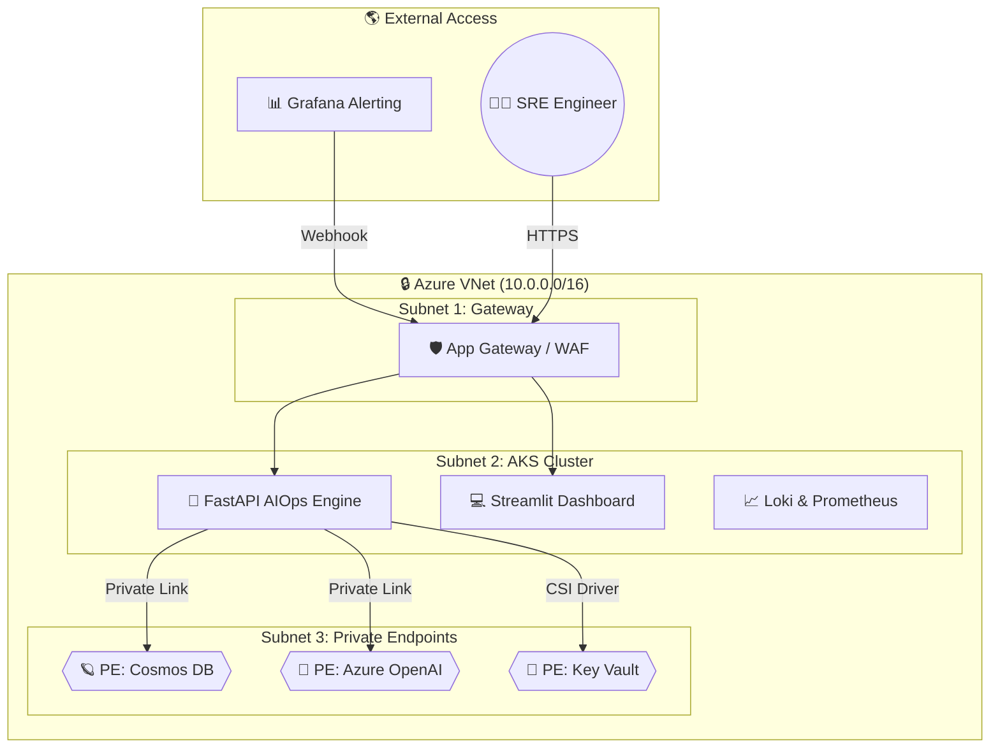
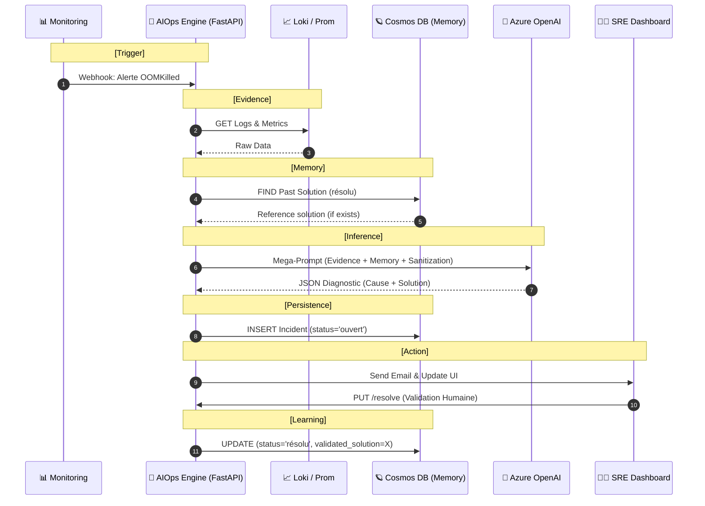

# 🛰️ Overview: SRE Assistant AIOps Platform

This document provides a 360° technical view of the AIOps platform. It details the infrastructure, the FastAPI backend architecture, the intelligent workflows, and the secure communication protocols.

---

## 1. Project Identity & Value Proposition
The **SRE Assistant AIOps** is a cognitive layer built on top of Azure infrastructure. It transforms raw monitoring data into actionable intelligence while strictly adhering to **Zero-Trust** and **FinOps** principles.

- **Automated Diagnosis**: Replaces manual log diving with AI-driven root cause analysis.
- **Auto-Learning Loop**: A persistent memory system that learns from human corrections.
- **Privacy-First**: No sensitive data (IPs, passwords) leaves the internal network.

---

## 2. Global Infrastructure View (Zero-Trust Network)

The infrastructure is orchestrated by **Terraform** and isolated in a multi-tier VNet.

---

## 3. The Brain: FastAPI Backend Architecture

The `assistant-sre` backend is a modular FastAPI application designed for high-concurrency and asynchronous processing.

### Internal Layers:
- **API (Transport)**: Handles HTTP requests, versioning (`/v1`), and background tasks.
- **Models (Validation)**: Pydantic schemas that enforce strict data typing and security.
- **Services (Logic)**:
    - `Loki/Prom Clients`: Async evidence gatherers.
    - `Sanitizer`: Regex-based data anonymization engine.
    - `LLM Engine`: Mega-Prompt generator and OpenAI orchestrator.
    - `Database`: Async Mongo driver (Motor) for incident persistence and memory.
    - `Notification`: SMTP handler for Outlook alerting.

---

## 4. Operational Workflow: The AIOps Cycle

The power of the platform lies in its 8-step operational cycle:

---

## 5. Technical Communication Matrix

Every communication is secured and uses specific protocols/ports:

| Connection | Protocol | Security Layer | Purpose |
|---|---|---|---|
| **Grafana → Backend** | HTTP / JSON | WAF + Internal DNS | Alert Trigger |
| **Backend → Loki/Prom** | HTTP / LogQL | Network Isolation | Evidence Collection |
| **Backend → Cosmos DB** | MongoDB Wire (10255) | **Private Endpoint** | Incident Memory |
| **Backend → OpenAI** | HTTPS (443) | **Private Endpoint** | AI Diagnosis |
| **Backend → Key Vault** | HTTPS (443) | **Managed Identity** | Secret Management |
| **Backend → Outlook** | SMTP (587) | TLS Encryption | SRE Notification |
| **Frontend → Backend** | REST API | CORS + WAF | User Interface |

---

## 6. Key Features Detail

### A. Auto-Learning (The "Memory")
The platform doesn't just use AI; it learns from humans. When an SRE clicks the **"Valider"** button, the final solution is stored. The next time the same alert triggers, the backend retrieves this solution and feeds it to the IA, ensuring consistent and expert-validated diagnostics.

### B. Sanitization (The "Privacy")
Logs are never sent "raw" to the cloud. The Sanitizer service masks sensitive data:
- `192.168.1.10` → `X.X.X.X`
- `password=admin123` → `password=***`
- `Bearer eyJ...` → `Bearer ***`

### C. Background Processing
The Backend uses **FastAPI BackgroundTasks** to ensure high availability. The webhook returns a `202 Accepted` to Grafana in milliseconds, while the heavy IA analysis runs in the background.
